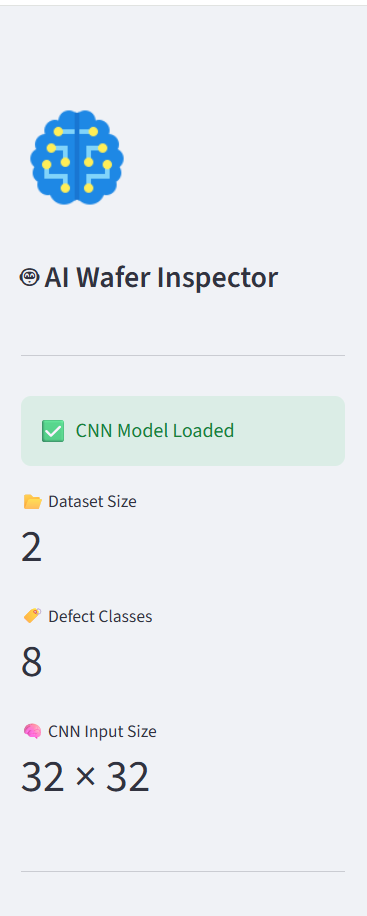

# 🧠 AI Semiconductor Wafer Defect Detection using CNN + Explainable AI

## 📌 Project Overview

This project is an AI-powered semiconductor wafer inspection system that automatically detects wafer defect patterns using a Convolutional Neural Network (CNN).

The application is deployed using Streamlit and integrates Explainable AI (Grad-CAM) to visualize which regions of the wafer influenced the model's prediction.

---

## 🌐 Live Demo

🔗 https://YOUR-STREAMLIT-APP.streamlit.app

## 💻 GitHub Repository

https://github.com/mohithmanjunath04-debug/AI-Semiconductor-Wafer-Defect-Detection

## 🚀 Features

- CNN-based wafer defect classification
- Automatic defect prediction
- Prediction confidence score
- Explainable AI using Grad-CAM
- Top-3 prediction probabilities
- Classification report
- Confusion matrix
- PDF prediction report generation
- Interactive Streamlit dashboard

---

## 🛠️ Tech Stack

- Python
- TensorFlow / Keras
- Streamlit
- Pandas
- NumPy
- OpenCV
- Matplotlib
- Seaborn
- Scikit-image
- ReportLab

---

## 📂 Dataset

**LSWMD (Large Scale Wafer Map Dataset)**

The dataset contains semiconductor wafer maps with multiple defect patterns used for CNN training and evaluation.

---

## 🧠 CNN Defect Classes

- Center
- Donut
- Edge-Loc
- Edge-Ring
- Loc
- Near-full
- Random
- Scratch

---

## 📊 Model Performance

| Metric | Value |
|---------|------:|
| Accuracy | **87.66%** |
| Precision | **88.87%** |
| Recall | **87.66%** |
| F1 Score | **87.97%** |

---

## 📈 Results

- CNN achieved approximately **87.66% test accuracy**.
- Successfully classified **8 semiconductor wafer defect classes**.
- Integrated **Grad-CAM** for explainable AI visualization.
- Generates downloadable **PDF prediction reports**.
- Deployed as an interactive **Streamlit web application**.

## 📸 Screenshots

### Dashboard



---

### Prediction


---

### Grad-CAM


---

### Evaluation


---

## ⚙️ Installation

```bash
git clone https://github.com/mohithmanjunath04-debug/AI-Semiconductor-Wafer-Defect-Detection.git

cd AI-Semiconductor-Wafer-Defect-Detection

pip install -r requirements.txt

streamlit run app.py
```

---

## 📁 Project Structure

```text
AI-Semiconductor-Wafer-Defect-Detection/
│
├── app.py
├── requirements.txt
├── README.md
│
├── data/
│   └── LSWMD_sample.pkl
│
├── models/
│   ├── wafer_defect_cnn.keras
│   ├── label_encoder.pkl
│   ├── classification_report.csv
│   └── confusion_matrix.npy
│
├── utils/
│   ├── data_loader.py
│   ├── model_loader.py
│   ├── gradcam.py
│   └── pdf_generator.py
│
└── screenshots/
    ├── dashboard.png
    ├── prediction.png
    ├── gradcam.png
    ├── evaluation.png
    └── pdf_report.png
```

---

## 🚀 Future Improvements

- Train using the complete LSWMD dataset
- Improve CNN accuracy using transfer learning
- Deploy on cloud infrastructure
- Integrate real-time wafer inspection
- Support additional semiconductor defect categories

---

## 👨‍💻 Developer

**Mohith Manjunath**

Artificial Intelligence • Machine Learning • Semiconductor Manufacturing

---

## 📜 License

This project is developed for educational and research purposes.